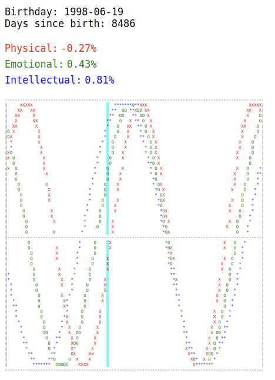

# react-biorhythm

A fun React component to display a biorhythm graph on screen



## Usage

```typescript
<Biorhythm
  birthday={birthday}  // (Optional)
  width={100}  // character width of the chart (Optional)
  height={50}  // character height of the chart (Optional)
  daysBeforeToday={20}  // days to show before today in chart (Optional)
  daysAfterToday={30}  // days to show after today in chart (Optional)
/>
```

## Formula used
```
rhythm = sin(2*PI*t*T)
```

where T is the period of one of the below cycles

| Period | Cycle Type |
|--------|------------|
| 23 | Physical |
| 28 | Emotional |
| 33 | Intellectual |

and t is the number of days since birth i.e.
```
t = today - birthday
```

## Wiki
https://en.wikipedia.org/wiki/Biorhythm_(pseudoscience)
